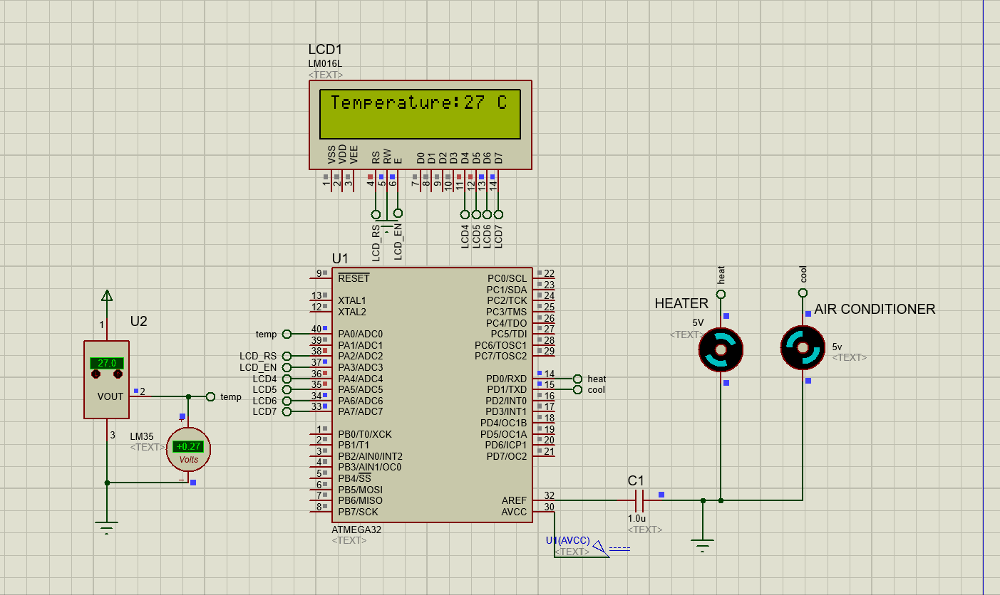

# Temperature-Control-System
Simulation of a temperature control system.

## System Componenets
* Atmega32
* LCD
* LM35 (temperature sensor)
* Motors (heater and air conditioner)

# Library used
* LCD
* ADC

## Demo

